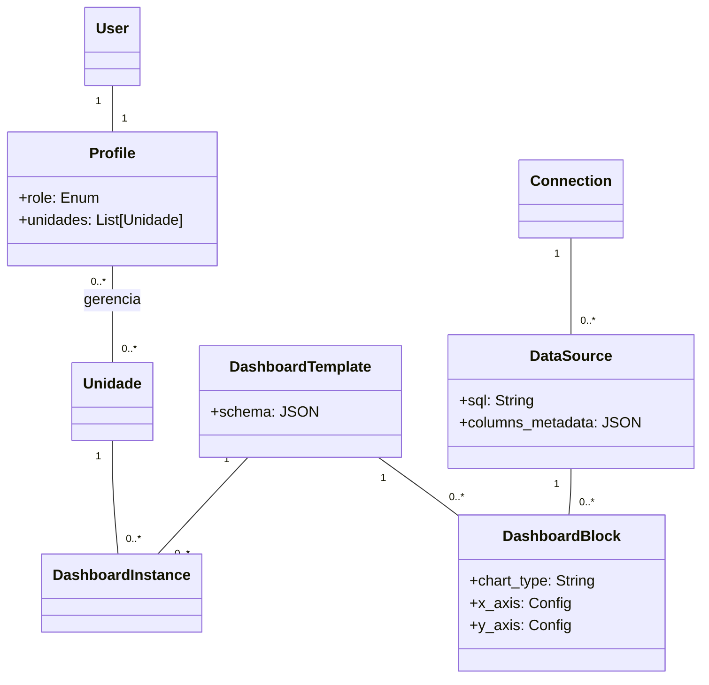

# Arquitetura do Sistema - MOS Tattoo Backend

Este documento descreve a arquitetura técnica do backend do projeto MOS Tattoo. O sistema foi projetado para ser uma plataforma robusta de analytics e gestão, utilizando **Django** e **Django Rest Framework (DRF)**.

## 1. Visão Geral da Stack Tecnológica

O projeto utiliza uma stack moderna baseada em Python, focada em produtividade e escalabilidade.

-   **Linguagem**: Python 3.10+
-   **Framework Web**: Django 4.2 (LTS)
-   **API Framework**: Django Rest Framework (DRF)
-   **Banco de Dados**: PostgreSQL 13+
-   **Autenticação**: JWT (JSON Web Tokens) via `djangorestframework-simplejwt`
-   **Gerenciamento de Dependências**: `pip` / `requirements.txt`
-   **Configuração**: `python-decouple` para variáveis de ambiente (.env)

## 2. Estrutura Modular (Django Apps)

O projeto segue uma arquitetura modular, dividindo responsabilidades em "Apps" do Django desacoplados.

### `core`
Núcleo da aplicação. Contém modelos fundamentais que são transversais a todo o sistema.
-   **Responsabilidade**: Gerenciar entidades negócio base, como `Unidade` (Filiais/Lojas).

### `accounts`
Gestão de identidade e acesso.
-   **Responsabilidade**: Extensão do modelo de usuário (`Profile`), autenticação e controle de permissões (RBAC).
-   **Padrão**: Utiliza relacionamento One-to-One com o `User` nativo do Django para adicionar metadados (cargos, acesso a unidades).

### `dashboards` (Motor de Analytics)
O coração da inteligência de dados do sistema. Este módulo implementa uma **Semantic Layer** (Camada Semântica).
-   **Responsabilidade**: Conexão com fontes de dados, definição de métricas, construção dinâmica de queries SQL e renderização de dashboards.

## 3. Padrões de Design e Arquitetura

### 3.1. Semantic Layer (Camada Semântica)
Diferente de abordagens tradicionais onde cada gráfico tem uma query SQL "chumbada", este projeto implementa uma camada semântica inspirada em ferramentas como Looker e Metabase.

1.  **DataSource (Dataset Base)**: Define *O QUE* está disponível.
    -   Contém uma query SQL bruta (`SELECT * FROM sales`) sem agregações.
    -   O sistema detecta automaticamente os tipos de dados (fatos vs dimensões).

2.  **DashboardBlock (Intenção Analítica)**: Define *COMO* visualizar.
    -   Armazena apenas a configuração JSON: "Quero somar o campo `valor` agrupado por `mes`".
    -   Não contém SQL. É agnóstico ao banco de dados.

3.  **QueryBuilder (Service Object)**: O motor de compilação.
    -   Recebe um `DataSource` + `DashboardBlock`.
    -   Gera o SQL final otimizado em tempo de execução.
    -   Aplica filtros segura e dinamicamente.

### 3.2. Generic Views & ViewSets
Utilizamos extensivamente os `ViewSets` do DRF para padronizar o CRUD e a leitura de dados.
-   **Benefício**: Redução de código boilerplate e consistência nas respostas da API.
-   Exemplo: `DashboardInstanceViewSet` gerencia listagem e detalhes de dashboards com poucas linhas de código, delegando a lógica complexa para o Serializer ou Services.

### 3.3. Role-Based Access Control (RBAC)
O controle de acesso é implementado no nível do Model/Manager e verificado nas Views.
-   **Admin Técnico / Gerente Geral**: Acesso global.
-   **Gerente de Unidade**: Escopo limitado apenas às unidades associadas ao seu perfil.
-   Isso é aplicado via `QuerySet filtering` nas Views (ex: `get_queryset` filtra dados baseado no `request.user`).

## 4. Fluxo de Dados (Data Flow) - Exemplo: Renderização de Dashboard

1.  **Request**: O Frontend solicita `GET /api/dashboards/{id}/data/`.
2.  **Auth & Permission**:
    -   JWT Middleware valida o token.
    -   View verifica se `user.profile` tem acesso à `Unidade` do dashboard.
3.  **Data Retrieval**:
    -   O sistema carrega os `DashboardBlocks` do template.
    -   Para cada bloco, invoca a **Semantic Layer**.
4.  **Query Execution**:
    -   O `QueryBuilder` compila o SQL final (base query + agregações + filtros de data/unidade).
    -   Executa a query no banco de dados (readonly replica se configurado).
5.  **Serialization**:
    -   Os dados brutos do DB são transformados em JSON padronizado (`x`, `series`).
6.  **Response**: JSON final é enviado ao frontend.

## 5. Diagrama de Entidades (Simplificado)

